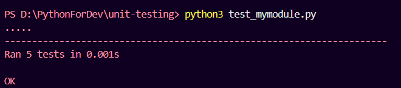

## Unit Testing

Unit testing is a method to validate if units of code are operating as designed. It is a software testing method where the smallest testable parts of an application, called units, are isolated and verified for correctness. It is performed by software developers during the coding phase and servers as the foundational level in the software testing pyramid. A "unit" typically refers to an individua; function, method, loop, or class.

<b> Unit Testing in Python</b>

In python, we use "unittest" module to perform unit testing.

`>import unittest`

The unittest module provides a rich set of tools for constructing and running tests. A test case is created by subclassing `unittest.TestCase`

- assertEqual() : to check the expected result
- assertNotEqual() : to check the expected result is not equal to given value
- for more, explore [text](https://docs.python.org/3/library/unittest.html)

The final block shows a simple way to run the tests. unittest.main() provides a command-line interface to the test script. When run from the command line, the above script produces an output that looks like this:
